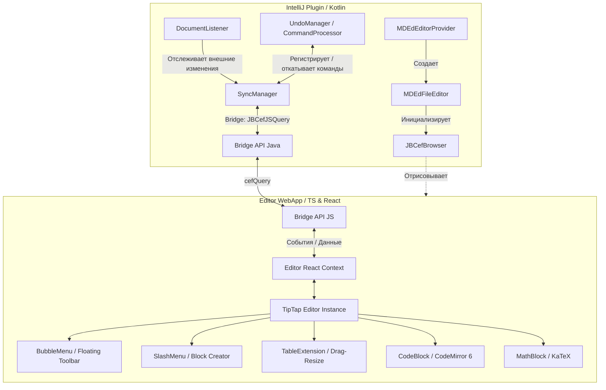

# Архитектура и технологический стек проекта MD|ed

Этот документ описывает архитектуру и технологический стек для реализации плагина интерактивного редактирования Markdown в IntelliJ IDEA. Выбранное решение базируется на интеграции встроенного браузера JCEF и современного веб-редактора на базе ProseMirror (TipTap).

---

## 1. Технологический стек (Tech Stack)

Проект разделен на две основные части: **IDE-плагин (нативный слой Java/Kotlin)** и **Веб-приложение редактора (веб-слой HTML5/TypeScript/React)**, работающее внутри JCEF.

```
┌────────────────────────────────────────────────────────┐
│               IntelliJ IDEA (Host IDE)                 │
│                                                        │
│  ┌──────────────────┐          ┌────────────────────┐  │
│  │  Kotlin / Java   │◄────────►│ JCEF (Chromium)    │  │
│  │  (IntelliJ SDK)  │  Bridge  │ ┌────────────────┐ │  │
│  └──────────────────┘          │ │ React / TipTap │ │  │
│                                │ └────────────────┘ │  │
│                                └────────────────────┘  │
└────────────────────────────────────────────────────────┘
```

### 1.1. Нативный слой (IntelliJ Platform)
* **Язык программирования:** Kotlin (рекомендуется для плагинов IntelliJ) или Java 17+.
* **Среда выполнения:** IntelliJ SDK (платформа версии 2023.2 и новее).
* **Компонент отображения:** `JBCefBrowser` (Java Chromium Embedded Framework) — встроенный в IDE браузер Chrome с поддержкой двустороннего выполнения JavaScript.

### 1.2. Веб-слой (Интерфейс редактора)
* **Сборщик:** Vite (быстрая сборка, Hot Module Replacement при разработке).
* **Фреймворк:** React + TypeScript (гарантирует строгую типизацию данных при передаче между IDE и JS).
* **Ядро редактора (WYSIWYG):** **TipTap** (на базе **ProseMirror**). 
  * *ProseMirror* отвечает за структуру документа (Schema), транзакции изменений, управление кареткой и выделением.
  * *TipTap* предоставляет готовую компонентную обертку и экосистему расширений.
* **Встроенный редактор кода:** **CodeMirror 6** (для редактирования блоков кода внутри Markdown с полноценным синтаксисом и подсветкой).
* **Рендеринг формул:** **KaTeX** (быстрый математический рендеринг без внешних зависимостей).
* **Стилизация:** CSS Variables + Tailwind CSS (для быстрого создания Notion-like UI с поддержкой смены тем).

---

## 2. Архитектура проекта и компонентов



### Описание ключевых компонентов:
* **`MDEdFileEditor`:** Реализация интерфейса `FileEditor` в IntelliJ. Интегрирует веб-страницу редактора в качестве стандартной вкладки IDE.
* **`SyncManager`:** Синхронизирует состояние документа. Принимает изменения из веба и записывает их в `Document` IntelliJ, а также слушает изменения `Document` (например, от внешних файлов) и отправляет их в веб.
* **`Bridge API (Java/JS)`:** Построен на базе `JBCefJSQuery`. Позволяет отправлять JSON-сообщения между Kotlin и React.
* **`TipTap Editor`:** Центральный контроллер редактора, управляющий состоянием документа в формате JSON/HTML и транслирующий его в разметку Markdown при сохранении.

---

## 3. Протокол взаимодействия (Java-JS Bridge)

Связь между средами происходит асинхронно через сериализованные JSON-сообщения.

### 3.1. Запросы от JS к Java (Сохранение, системные события)
Реализуются через встроенную функцию `window.cefQuery`.

* **Сохранение изменений (Debounced Save):**
  ```json
  {
    "action": "saveDocument",
    "payload": {
      "markdown": "# Header\nContent here...",
      "requestId": "12345"
    }
  }
  ```
* **Регистрация команды в истории IntelliJ (для Undo/Redo):**
  Поскольку TipTap ведет свою историю локально, регистрация команды в IntelliJ происходит при отправке debounced-сохранения, создавая укрупненную точку отката.
  ```json
  {
    "action": "registerCommand",
    "payload": {
      "commandName": "Редактирование Markdown"
    }
  }
  ```
### 3.2. Запросы от Java к JS (Инициализация, внешние изменения, Undo/Redo)
Реализуются через `JBCefBrowser.executeJavaScript()`.

* **Вставка изображения после перетаскивания (Drag & Drop):**
  Обработка файлов происходит на стороне Java через нативный `DropTargetListener`, прикрепленный к JCEF. Java перехватывает путь к файлу, копирует его в папку `images/` проекта и отправляет команду в веб-слой для вставки картинки:
  ```javascript
  window.MDEdBridge.insertImage({
    path: "images/screenshot.png",
    alt: "screenshot"
  });
  ```

* **Инициализация редактора контентом:**
  ```javascript
  window.MDEdBridge.initDocument({
    markdown: "# Hello World",
    theme: {
      isDark: true,
      textColor: "#abb2bf",
      backgroundColor: "#282c34",
      accentColor: "#61afef"
    }
  });
  ```
* **Обновление контента при внешнем изменении:**
  ```javascript
  window.MDEdBridge.updateContent({
    markdown: "# Hello World (Updated externally)"
  });
  ```
* **Вызов Undo / Redo со стороны IDE:**
  ```javascript
  window.MDEdBridge.triggerUndo();
  window.MDEdBridge.triggerRedo();
  ```

---

## 4. Синхронизация данных и работа с Markdown

Главная сложность WYSIWYG Markdown-редакторов — это преобразование древовидной структуры документа в линейный текст разметки без потери пользовательского форматирования (spaces, linebreaks, asterisks vs underscores).

### 4.1. Схема жизненного цикла документа:
1. **Открытие файла:** Kotlin считывает `.md` файл -> Передает контент в веб в виде строки.
2. **Парсинг:** TipTap-Markdown парсер превращает Markdown-строку в ProseMirror JSON (дерево блоков).
3. **Редактирование:** Пользователь изменяет блоки (React + TipTap).
4. **Синхронизация (Сохранение):** 
   * TipTap генерирует Markdown-строку из текущего состояния дерева блоков.
   * Строка отправляется через Bridge в Kotlin.
   * `SyncManager` в IntelliJ выполняет запись изменений в `Document` внутри безопасного контекста `WriteCommandAction`.

### 4.2. Алгоритм предотвращения циклов обновлений (Update Loop)
Чтобы автосохранение не вызывало повторный парсинг и сброс курсора:
1. Каждому обновлению присваивается инкрементальный `versionId`.
2. Если `Document` изменился в IntelliJ в результате сохранения из веба (версии совпадают), `DocumentListener` игнорирует это событие.
3. Если `Document` изменился извне (версия IDE стала больше версии веба), Kotlin отправляет команду `updateContent` в веб. Редактор выполняет точечное обновление дерева блоков (ProseMirror Diff), стараясь сохранить текущее положение курсора пользователя.

---

## 5. Интеграция с дизайном IDE (Theme Sync)

Чтобы плагин выглядел нативно, веб-интерфейс должен адаптироваться под выбранную тему IntelliJ (Darcula, Light, Rider Dark и др.).

1. **Сбор цветов в Kotlin:**
   При открытии редактора и при смене темы в IDE (`LafManagerListener`), Kotlin извлекает системные цвета через API:
   * Цвет фона: `UIUtil.getEditorPaneBackground()`
   * Цвет текста: `UIUtil.getLabelForeground()`
   * Цвет рамок: `JBColor.border()`
2. **Передача в CSS:**
   Цвета передаются в JS и записываются в CSS-переменные корневого элемента:
   ```css
   :root {
     --bg-color: #282c34;
     --text-color: #abb2bf;
     --border-color: #3e4451;
   }
   ```
3. **Использование в стилях:**
   Компоненты веб-интерфейса стилизуются с использованием этих переменных, что гарантирует 100% совпадение цветовой гаммы с IDE.
